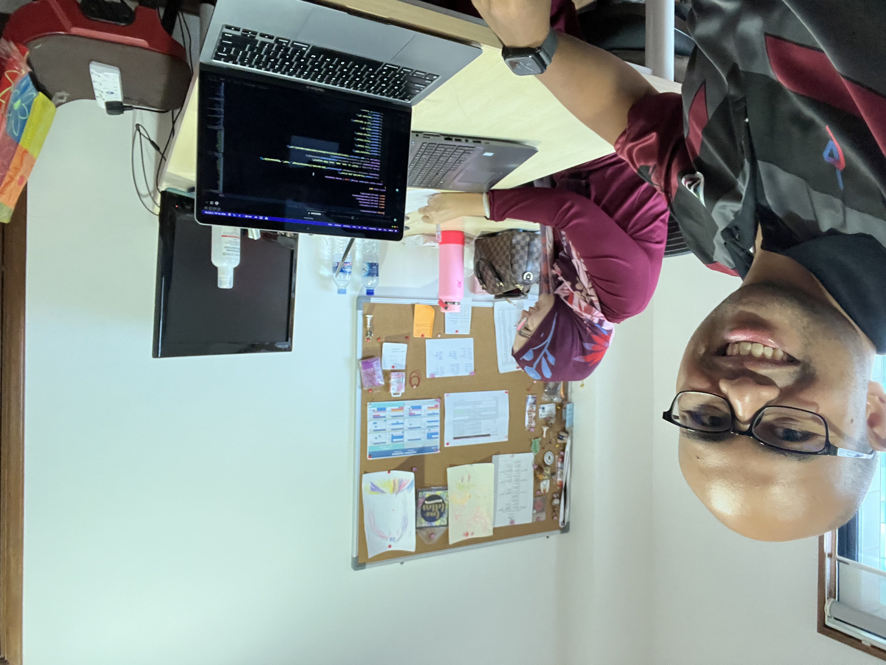
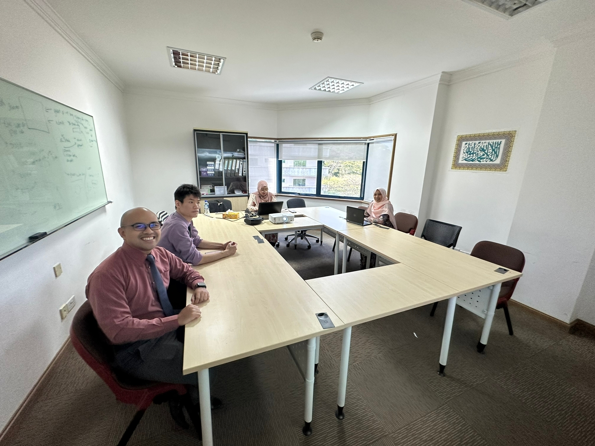
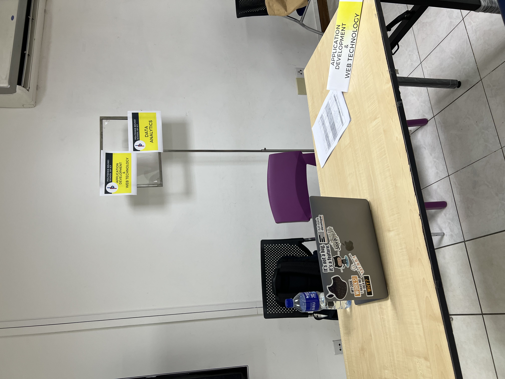
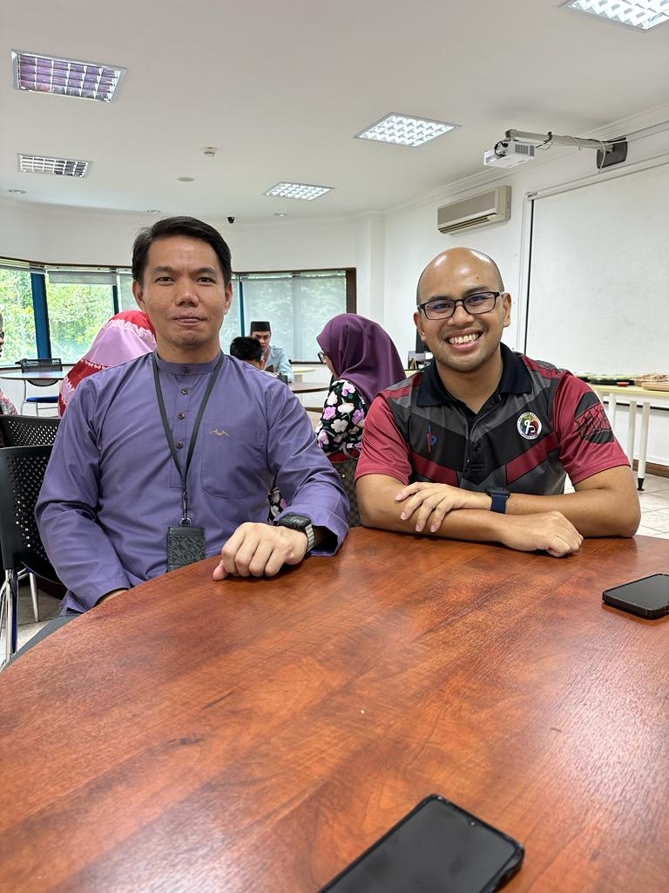
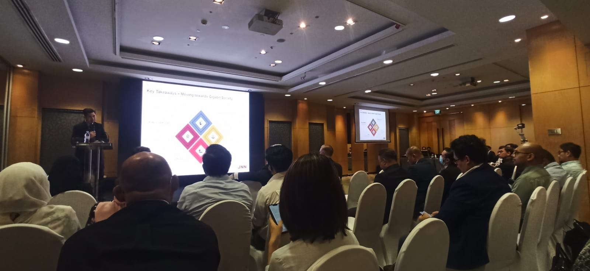
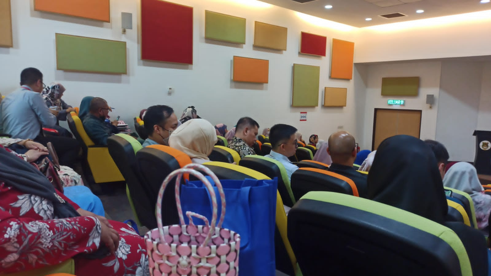
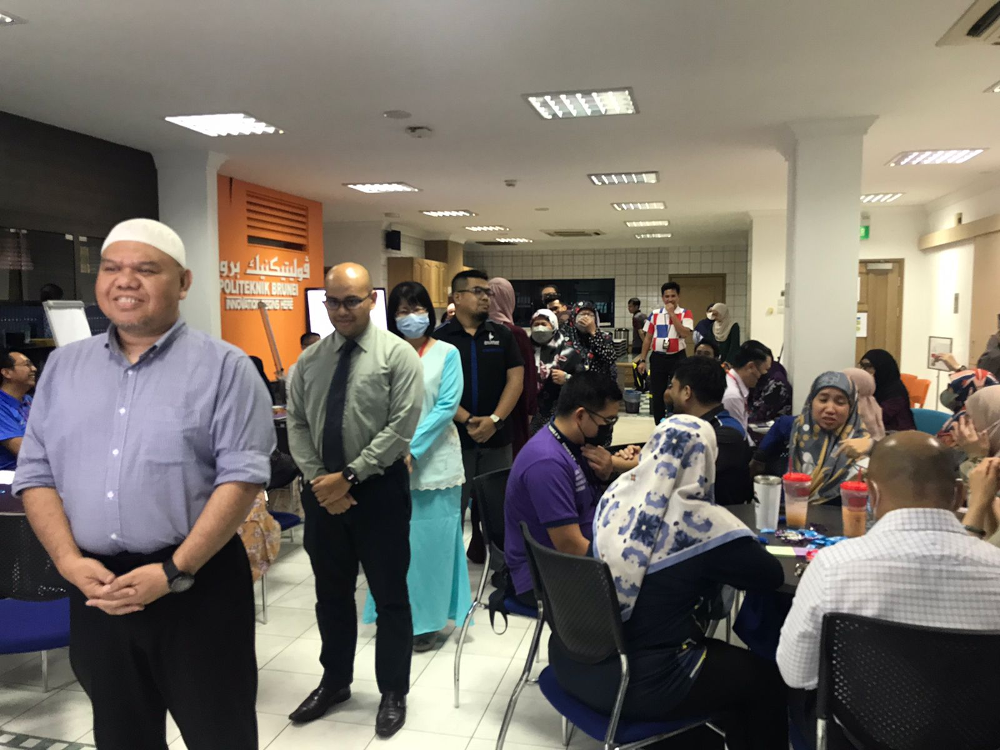

## 1. PBAS Training

Prior to taking a leave to take DTE course, I was heavily involved with the development of Politeknik Brunei’s Admission System (PBAS) as one of the System Developers and Administrators. To prevent overburdening me from these tasks, I was only tasked to provide advice when needed in terms of previous implementations. There are occasions where I needs to give advice. Another task is to give training to Cikgu Atiqah Musfirah Leong binti Mohd Dennis Leong on how to extract applicants’ data from PBAS.

---

## 2. SICT Cloud and Networking Programme Meeting

I was also involves with finalising SICT’s new Diploma Level 5 programme that will be offered in July 2023 which is Cloud and Networking. The task is to discuss and give feedback the programming modules in the programme.

---

## 3. PB Open Day

During Politeknik Brunei’s 3 days open day event, I was tasked to man a booth for two of SICT new Diploma Level 5 programmes, Application Development and Web Technology, for one of the afternoon sessions. The task is to entertain interested students and provide them with appropriate information about the programmes. During the event, I managed to entertain 5 students with their family members.

---

## 4. SICT Tahlil

Before the month of Ramadan, SICT conducted a Tahlil event which I attended as well. 

---

## 5. UNN Symposium

Attended 2-days United National Networks Symposium 2023 where the topics of discussions are: ICT Infrastructure, Mindset and Talentpool, and Public-Private Partnership.

---

## 6. PB Town Hall

Attended Politeknik Brunei's Town Hall where the top management brief the progress and future plans for the institution. Also conducted questions and answers session to listen for any concerns from PB staffs.

## 7. PB Engagement Day

Attended Politeknik Brunei's Engagement Day. The main purpose of the engagement day is to get feedback about PB's plan to change its working day from Monday-Thursday, Saturday to Monday-Friday.

