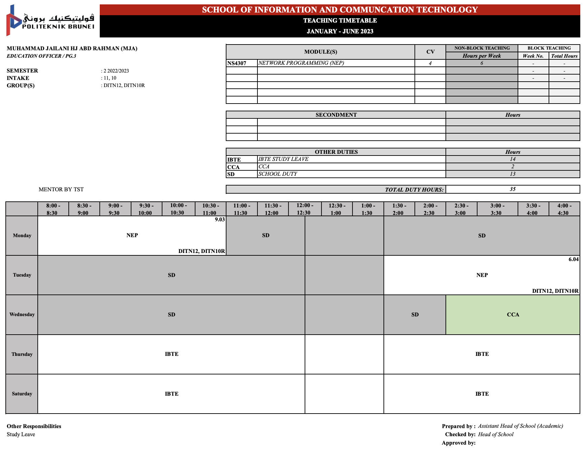

## 1. Module information
### 1.1. Description
This module focuses on the design and implementation of client-server applications. Reviewing two (2) standard internet protocols; Transmission Control Protocol (TCP) and User Datagram Protocol (UDP), which are useful for implementing network applications using socket application programming interface. Introduce students to concurrent programming and web applications development.

### 1.2. Aims
This module aims to expose students with knowledge and skills to develop client-server applications

### 1.3. Objectives
Upon completion of this module, students should be able to:
- Understand the key protocols that support the Internet.
- Familiarise with programming interfaces for network communication.
- Have detailed knowledge of the tools needed to construct client-server applications.

## 2. Module timetable

## 3. Scheme of works

**Programme:** IT Network and Security

**Module Code & Name:** NS4307 Network Programming

**Credit Value:** 4.0

**Semester / Year:** Semester 2, 2022/2023

**Module Lecturer:** Mohammad Jailani Haji Abdul Rahman

| Week | Date | Topics | Remarks |
| --- | --- | --- | --- |
| 01 | 23/01 – 29/01 | Module Induction, Git | 23/01 - Chinese New Year Holiday (Monday) |
| 02 | 30/01 – 05/02 | Git |  |
| 03 | 06/02 – 12/02 | Introduction to Network Programming, Java Binary Input & Output |  |
| 04 | 13/02 – 19/02 | Java Sockets | 18/02 - Isra’ Mi’raj (Saturday) |
| 05 | 20/02 – 26/02 | Java Sockets | 23/02 – Brunei National Day (Thursday) |
| 06 | 27/02 – 05/03 | Java Web Application |  |
| 07 | 06/03 – 12/03 | Java Web Application, Assignment Clinic |  |
| 08 | 13/03 – 19/03 | Mid Semester Break |  |
| 09 | 20/03 – 26/03 | Java Web Application | 23/03 - First day of Ramadhan (Thursday) |
| 10 | 27/03 – 02/04 | Database, MySQL |  |
| 11 | 03/04 – 09/04 | MySQL, Java Persistence API | 08/04 - Nuzul Al-Quran (Saturday) |
| 12 | 10/04 – 16/04 | Java Persistence API |  |
| 13 | 17/04 – 23/04 | Assignment Clinic | 22/04 - 23/04 - Hari Raya Aidilfitri (Satuday - Sunday) |
| 14 | 24/04 – 30/04 | No classes due to public holiday | 24/04 - 25/04 - Hari Raya Aidilfitri (Monday) |
| 15 | 01/05 – 07/05 | Java Persistence API |  |
| 16 | 08/05 – 14/05 | Revision |  |
| 16 | 15/05 – 21/05 | Revision Week |  |
| 17+ | 22/05 - 18/06 | Examination & Resit Week | 31/05 – Royal Brunei Armed Forces Anniversary |

## 4. Assessment details

| Assessment | Related Topics | Date of Assessment | Weightage |
| --- | --- | --- | --- |
| Continuous Assessments | All topics | 30/01/2023 - 04/05/2023 (First Attempt), No Second Attempt | 10% |
| Assignment | Introduction to Network Programming, Java Binary Input Output and Java Socket | 20/02/2023 - 20/03/2023 (First Attempt), 10/04/2023 - 29/04/2023 (Second Attempt) | 25% |
| Assignment | Java Web Application, Database, MySQL and Java Persistence API | 25/03/2023 - 27/04/2023 (First Attempt), 08/05/2023 - 20/05/2023 (Second Attempt) | 25% |
| Examination | All topics | Examination Week | 40% |

## 5. Scheme of work



  

## 6. Tentative 16 weeks of weekly lesson plan


